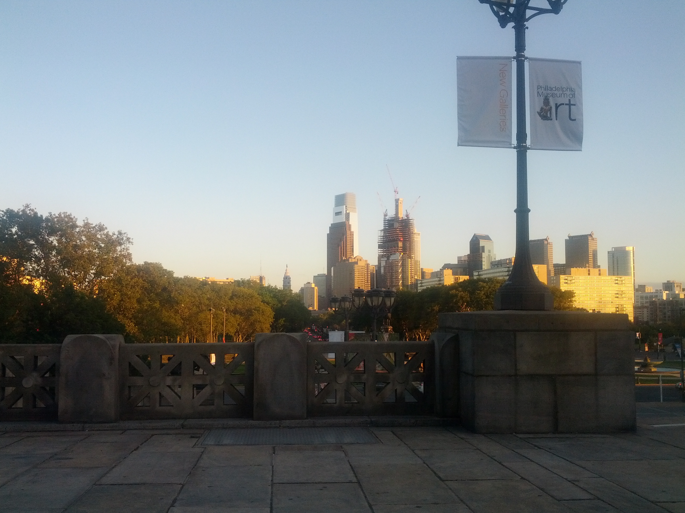

A longer flat walk accessible by regional train following the Wissahickon River back into Philly.

[The Green Ribbon Trail](http://www.wvwa.org/greenribbontrail/) runs into the Montgomery County Wissahickon Trail and almost abuts the [Philadelphia Country Wissahickon Trail](http://fow.org/visit-the-park/).

https://goo.gl/maps/cJjNjRk3A4v

Oct. 6 2016

Sunrise at 7:02 AM and Sunset 6:36 at PM left almost 12 hours of daylight.

Took the Lansdale/Doylestown Line to the North Wales stop (conductor prevented me from getting off at North Hills). Arrived at 8:35.

I walked South to the wrong end of the train platform (don't do that) then took Beaver St. and N. Sumneytown Pike around the Merck campus.  At the interseciont with Parkside Place there's a crosswalk with a button.

The trailhead is past the Upper Gwynedd municipal buildings:

Then I followed the trail along the creek. The weather was perfect and the woods looked like woods (but with better image quality): 

Ran into a couple runners, dogs dragging people on walks, and the occasional hoof prints and mountain bike tire tracks.

Note: the stepping stone stream crossings marked on the maps http://www.wvwa.org/greenribbontrail/ all have giant concrete stones so your feet are unlikely to get wet unless the river is really high.

Stopped at the [El Limon](https://goo.gl/maps/LLkWGNEZ5g52) in Ambler for lunch.  Ate a gigantic al pastor burrito con mole the size of two large clenched fists.

Continuing on the trail there was a nice spot where some crepuscular rays or "god light" hit the grass and dew nicely (but it's not visible in this image so you'll have to see it yourself): 

Note: there is broken glass on trail at places so watch your dog's feet

The green ribbon trail uses green blazes so they aren't easily spotted (I've heard white blazes on the AT in the snow are fun too).  Fortunately there are signs with white backgrounds and turn arrows all over the place. Also, the trail follows roads and driveways at places. These are usually well marked with signs saying which way to go:

Generally continuing along the direction of the last sign and following the creek works. A few places where I wasn't fully sure of the path were: 

* on the Green Ribbon trail a sign that points down a driveway leading out to a road (the trail continued on the other side of the road but it wasn't in line-of-sight so I kind of hopefully wandered that way)
* near Germantown Academy after crossing an old stone bridge given by some class (follow the river to the right/not the way you came) 
* the high ropes course near Germantown Academy has a lot of branching paths but no blazes or signs (following the river worked though)
* after the Turnpike and crossing W. Valley Green Rd. don't follow the creek (since that leads to Flourtown)

Also, after the Turnpike everything is mostly paved or gravel. 

Eventually I reached the end of the Montgomery County Wissahickon Trail:

Google Street View of that spot: https://www.google.com/maps/@40.102099,-75.2306219,3a,75y,298.02h,62.71t/am=t/data=!3m6!1e1!3m4!1sW2NTCS2mkRSI6BtgWyopkw!2e0!7i13312!8i6656

Getting from the Montgomery County Wissahickon Trail to Philadelpiha County Wissahickon Trail was probably the worst part. I hung a left to follow Stenton Ave. but the bridge has no shoulder on either side of the road and there's a fair bit of traffic. I climbed on top of the barrier wall since oncoming traffic from both directions would probably end badly:

https://www.google.com/maps/@40.102099,-75.2306219,3a,75y,147.49h,80.15t/am=t/data=!3m6!1e1!3m4!1sW2NTCS2mkRSI6BtgWyopkw!2e0!7i13312!8i6656

There's also no shoulder and some incline on either side of the road:  

https://www.google.com/maps/@40.095821,-75.227338,3a,75y,142.88h,86.19t/am=t/data=!3m6!1e1!3m4!1sg2VLgrgSdwsIpcVqK32HJQ!2e0!7i13312!8i6656

But once you hit the light there's a car sized path across from Morris Arboretum (which will be helpful when I become car sized):

https://www.google.com/maps/@40.0929969,-75.2237232,3a,75y,177.62h,80.34t/am=t/data=!3m6!1e1!3m4!1sU9aF0Vi5_hMlwRBgMWnAHw!2e0!7i13312!8i6656

TODO: look into why Penn owns an Arboretum so far away from its campus

Maybe there's a better way to walk from one county's trail system to the other. 

Anyway, after passing Chestnut Hill College I took a left onto Germantown Ave and was back in Philadelphia County. We can see more trash too, because more people and greater trail usage presumably.

The Orange Trail on the east side of the creek is more interesting walking (not pavement) and includes this fire hydrant ([more fire hydrants](http://billypenn.com/2016/10/07/the-8-sexiest-fire-hydrants-in-philadelphia/)):

and the fingerspan bridge:

But if you were biking from around the Turnpike you could stay on the dirt and gravel Forbidden Drive.

It started getting dark early in the gorge 4pm, but street lights turned on.

Following the gorge out I ended up south of Manayunk and took the Schuylkill River trail back to the Art Museum where it was nice to sit down for a minute:

